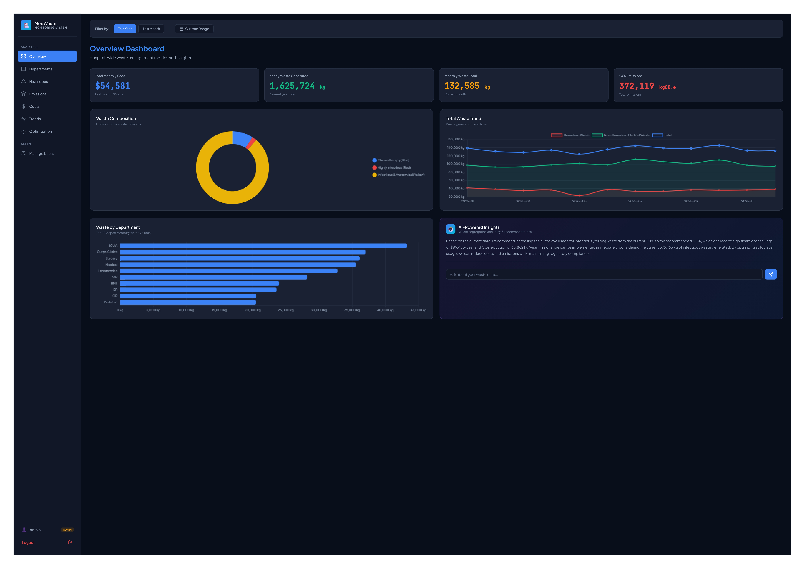
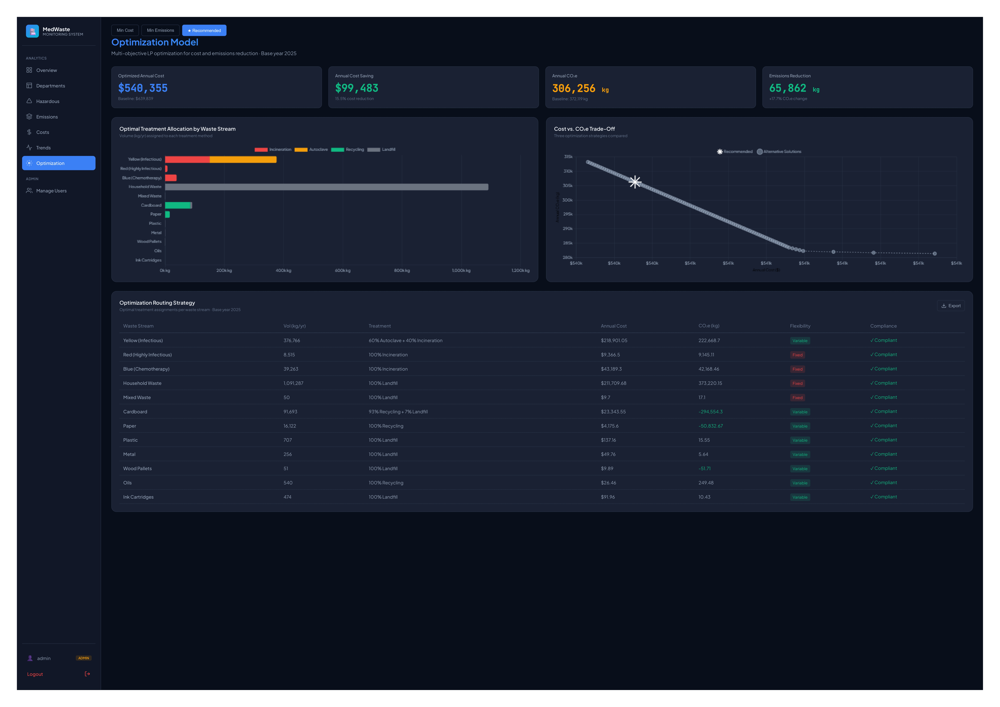

# Medical Waste Monitoring Dashboard

A full-stack Flask dashboard for hospital medical waste management with AI-powered insights, built as an RIT Dubai Senior Design capstone project.

**Live Demo:** https://medical-waste-dashboard.onrender.com

> **Note:** This repository contains the application code only. The operational dataset is confidential hospital data and is not included. The forecasting and optimization model implementations were developed by a separate engineering team and are likewise not part of this repository (see *Team & Role* below).

## About

This dashboard was developed for a hospital to monitor medical waste operations across seven interactive screens, processing 62,000+ operational records. It surfaces forecasting and optimization model outputs through an accessible interface designed for non-technical hospital management, and integrates a vision-based AI assistant that analyzes live dashboard screens to provide context-aware recommendations.

The project was selected by GDRFA to be showcased at the AI X Lab Inauguration (June 2025).

## Screenshots

### Overview Dashboard

### Optimization & Treatment Routing

## Features

- **Overview Dashboard** — KPIs, waste composition, department breakdown, AI recommendations
- **Department Performance** — Waste by department, shift breakdown, monthly heatmap
- **Hazardous Waste** — Yellow/Red/Blue bag tracking and compliance monitoring
- **Environmental Impact** — CO2 emissions tracking, recycling savings, baseline comparisons
- **Cost Efficiency** — Transport and disposal costs, cost per kg, department cost ranking
- **Trends & Forecasting** — Historical patterns and forecasting model predictions
- **Optimization** — Pareto frontier visualization, treatment routing recommendations
- **AI Chat** — Context-aware Q&A powered by screenshot analysis
- **User Management** — Role-based access with an admin panel for user creation

## Tech Stack

- **Backend:** Flask 3.0, Flask-SQLAlchemy, Flask-Login
- **Data Processing:** Pandas, OpenPyXL (62,000+ records)
- **Visualization:** Chart.js 4.4
- **AI:** Groq API with LLaMA 4 Scout (vision model)
- **Database:** SQLite
- **Deployment:** Render
- **Styling:** Custom CSS, Plus Jakarta Sans

## Architecture

The application follows a service-oriented structure:

- `app.py` — application entry point and route registration
- `blueprints/` — route handlers grouped by feature
- `*_service.py` — business logic for data, AI, forecasting, and optimization (the forecasting and optimization services consume model outputs supplied by the engineering team)
- `models/` — SQLAlchemy models
- `config.py` — configuration via environment variables
- `templates/` & `static/` — frontend

## Setup

1. **Create and activate a virtual environment**
   \`\`\`bash
   python -m venv venv
   source venv/bin/activate      # macOS/Linux
   venv\Scripts\activate         # Windows
   \`\`\`

2. **Install dependencies**
   \`\`\`bash
   pip install -r requirements.txt
   \`\`\`

3. **Configure environment**
   \`\`\`bash
   cp .env.example .env
   \`\`\`
   Then add your own \`SECRET_KEY\` and \`GROQ_API_KEY\` to the \`.env\` file.

4. **Provide a dataset**
   Place your dataset at the path defined in \`config.py\` (\`DATA_FILE\`). The operational hospital data used in the original project is confidential and not distributed.

5. **Run the app**
   \`\`\`bash
   python app.py
   \`\`\`
   Open http://localhost:5001 and log in with credentials created via the admin panel.

## API Endpoints

| Endpoint | Method | Description |
|----------|--------|-------------|
| \`/api/waste-composition\` | GET | Waste breakdown by bag type |
| \`/api/department-heatmap\` | GET | Monthly waste by department |
| \`/api/department-waste\` | GET | Waste volumes by department |
| \`/api/hazardous-trend\` | GET | Monthly hazardous waste volumes |
| \`/api/cost-trend\` | GET | Monthly cost breakdown |
| \`/api/emissions-trend\` | GET | Monthly CO2e emissions |
| \`/api/forecast-data\` | GET | Historical and predicted waste |
| \`/api/optimization-pareto\` | GET | Pareto frontier data |
| \`/api/ai-recommendation\` | POST | AI analysis of current page |
| \`/api/ai-chat\` | POST | Conversational AI Q&A |

All data endpoints accept optional query parameters: \`period\`, \`start_date\`, \`end_date\`.

## Team & Role

Built as part of an RIT Dubai Senior Design project (2025–2026). I owned all software implementation, AI integration, and deployment — the Flask application, data and AI services, frontend, authentication, and Render deployment.

The forecasting (LightGBM) and optimization (linear programming) models were developed by a separate IE/ME engineering team. This application integrates and visualizes their outputs; the model implementations themselves are not included in this repository.

## License

MIT
